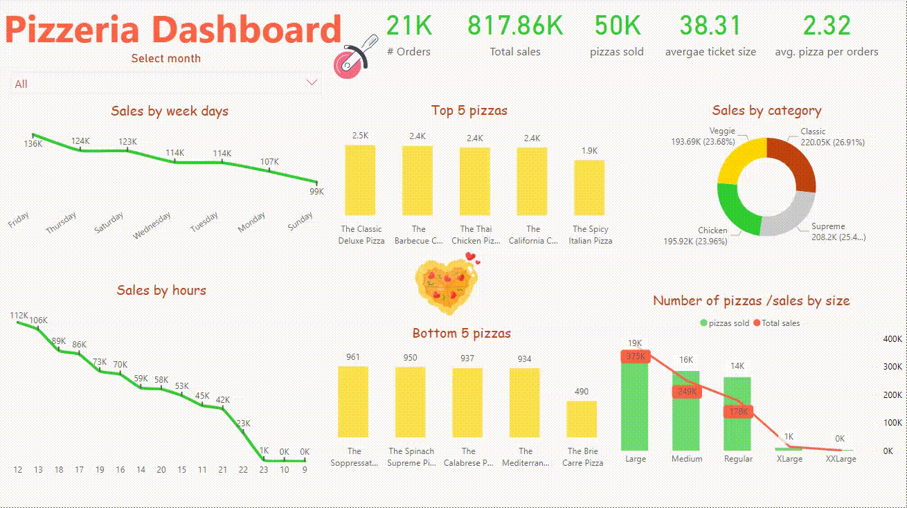
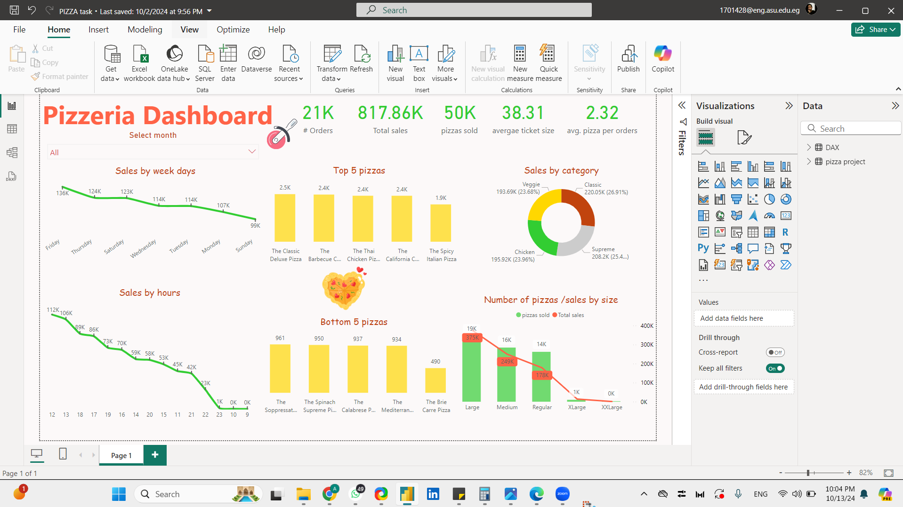

# pizza-bi-data-analysis
# 🍕 Pizza Store Data Analysis Project

**Project Overview**  
This project involves analyzing pizza store sales data to uncover trends, insights, and key metrics that help inform business decisions. The data was extracted in Excel, transformed using **Power Query**, and visualized in **Power BI** to create an interactive, user-friendly dashboard.

---

## 📊 Project Details

- **Data Source**: Excel
- **Data Transformation**: Power Query
- **Visualization**: Power BI
- **Calculations**: DAX (Data Analysis Expressions)
- **Theme**: Pizza-inspired colors (red, green, beige)

### Objectives
1. **Analyze Sales Trends**: Identify high and low-demand periods and seasonal trends.
2. **Product Performance**: Determine which pizzas and toppings are most popular.
3. **Customer Insights**: Understand purchase patterns by customer demographics and location.
4. **Revenue Insights**: Track overall revenue and revenue generated per item.

---

## 🔧 Process

### 1. Data Extraction & Cleaning
   - **Excel**: Raw sales data was imported from Excel.
   - **Power Query**: Used to clean and transform the data for analysis, including removing duplicates, handling missing values, and restructuring columns for easier interpretation.

### 2. Data Transformation
   - **Power Query**: Applied various transformations like splitting columns, merging tables, and normalizing data.
   - **DAX Functions**: Used to create custom calculated columns and measures for in-depth analysis, including:
     - Total Sales
     - Average Order Value
     - Customer Lifetime Value

### 3. Data Visualization
   - **Power BI Dashboard**: Designed an interactive dashboard to visualize insights in a user-friendly manner. This included:
     - **Sales Trends**: Line and area charts to show daily, weekly, and monthly sales trends.
     - **Product Performance**: Bar charts to compare sales of various pizza types and toppings.
     - **Customer Insights**: Heatmaps to visualize sales by location, age group, and order frequency.
     - **Revenue Breakdown**: Donut and pie charts for revenue distribution across products.

---

## 🖼️ Dashboard Highlights

The dashboard is styled with a pizza-inspired color theme of **red, green, and beige** to match the pizza store vibe and enhance readability. Key components include:

- **Interactive Filters**: Filter by pizza type, customer location, and time period.
- **Dynamic Visuals**: Automatically updates based on selected filters for a seamless user experience.
- **KPI Cards**: Display key metrics like total sales, best-selling pizza, and revenue per customer.

---

## 🛠️ Tools Used

- **Power Query**: For data transformation and preprocessing.
- **Power BI**: For interactive data visualization and dashboard creation.
- **DAX**: For creating calculated columns and measures to power in-depth analysis.

---

## 🎨 Color Theme

The visuals are designed in a pizza-inspired color palette:

- **Red**: Represents tomato sauce and highlights important metrics.
- **Green**: Represents fresh toppings and is used for background and filter elements.
- **Beige**: Represents the pizza crust and serves as a neutral background for visual clarity.

---

## 📈 Key Insights

- **High Sales Days**: Identified weekends and holidays as peak sales times.
- **Popular Pizzas**: Certain pizza types and toppings are consistently high-performing.

- ## 📊 Visuals

 <!-- Replace with actual image link -->
_Example of the **Overview Tab** in the dashboard, showing key KPIs and total sales trends._

 <!-- Replace with actual image link -->
_Example of the **Customer Tab**, showcasing customer demographics and purchase frequency._

 <!-- Replace with actual image link -->
_Example of the **Product Tab**, highlighting the sales contribution of different products._
- **Customer Demographics**: Younger demographics and specific locations drive the majority of sales.
- **Revenue Contribution**: Certain high-priced pizzas contribute significantly to overall revenue, helping in targeted marketing.

---

Feel free to explore the **interactive dashboard** to gain insights into pizza sales performance and customer preferences. 🍕
